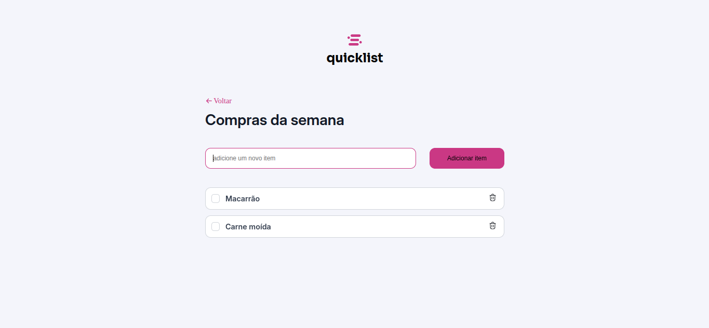

# 🛒 Lista de Compras
> Uma aplicação web simples para organizar suas compras – rápido, intuitivo e sem complicações!

[](LICENSE)

## 📸 Preview



Se preferir, veja funcionando no [GitHub Pages](https://ghutttyerrez.github.io/lista_de_compras/) <!-- Adapte se publicar a demo -->

---

## 📋 Tabela de Conteúdos

- [Sobre](#sobre)
- [Funcionalidades](#funcionalidades)
- [Como Usar](#como-usar)
- [Tecnologias](#tecnologias)
- [Contribuição](#contribuição)
- [Licença](#licença)
- [Contato](#contato)

---

## 📝 Sobre

O **Lista de Compras** é um projeto desenvolvido com foco em aprendizado e prática do front-end moderno. Com ele, você pode adicionar, visualizar e gerenciar itens da sua lista de compras de forma prática, direto do navegador.

---

## 🚀 Funcionalidades

- ✅ Adicionar novos itens à lista
- ❌ Bloqueia campos vazios ou inválidos
- ⚠️ Exibe mensagens de erro quando necessário
- 🗑️ Remover itens da lista
- ✨ Visual simples e responsivo

---

Abra o arquivo index.html no seu navegador
Não é necessário instalar dependências.
🛠 Tecnologias
HTML5 – Estrutura da aplicação
CSS3 – Estilização e layout responsivo
JavaScript (Vanilla) – Manipulação do DOM e lógica
🤝 Contribuição
Quer ajudar a melhorar?
Siga os passos abaixo:

Faça um fork do projeto
Crie uma nova branch: git checkout -b feature/sua-feature
Faça seu commit: git commit -m 'Minha contribuição'
Envie para o seu fork: git push origin feature/sua-feature
Abra um Pull Request

---

## ⚙️ Como Usar

1. **Clone o repositório**
   ```bash
   git clone https://github.com/ghutttyerrez/lista_de_compras.gitionamento

👨‍💻 Autor
Feito com dedicação por Jeferson Gutierrez Garai
Se quiser contribuir, fique à vontade para fazer um fork ou enviar uma pull request 🚀

📃 Licença
Este projeto está licenciado sob a licença MIT. Veja o arquivo LICENSE para mais detalhes.


